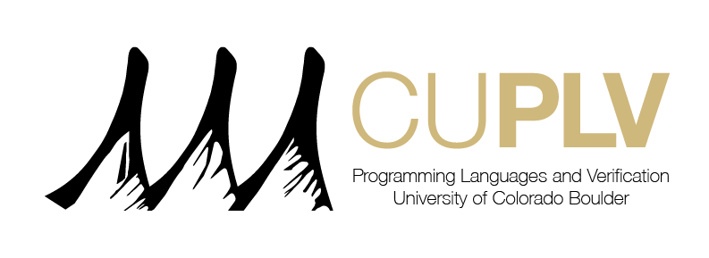

# Position: Student Research Assistant

## Job Description

Modern software systems --- whether they are web, mobile, distributed, or AI-driven --- are complex. This project aims to investigate techniques to algorithmically reason about modern software systems to witness bugs or prove their absence.

The Programming Languages and Verification Group at the University of Colorado Boulder (CUPLV) is looking for student research assistants with strong interest and experience with programming language semantics and program verification algorithms.

The research assistant will work with professor [Bor-Yuh Evan Chang].

The position is available immediately and for an undergraduate or graduate student and is part-time (for at least 10 hours per week, preferably at least 15). Pay rate will be competitive (from $16.82 to $38.70 per hour) and depend on degree and experience.

### Responsibilities

- Implement prototypes following best practices in software engineering (e.g., unit and integration testing, collaborative software development).
- Respect the planned deadlines and periodically update on the current progress.

### Qualifications

Please apply, if you possess the following:

- Students must be fluent in at least one functional programming language and interested in state-of-the-art programming language techniques (e.g., strong type systems and functional programming patterns as in Rust, Scala, etc.). 
- Highly self-motivated and enjoys working with and communicate well with a diverse team.

If you possess any of the following skills which we highly value, you will have an advantage:

- Having done some projects in Lean.
- Knowledge (theoretical or practical) in programming language tools, such as analyzers or compiler

### How to Apply

To apply, please send your resume or CV, the contact information for two or three references, and a link to your GitHub profile to Bor-Yuh Evan Chang [evan.chang@colorado.edu](mailto:evan.chang@colorado.edu).

Submissions received by Friday, May 1, 2026 will receive full consideration, but the position will remain open until filled.

[bor-yuh evan chang]: https://www.cs.colorado.edu/~bec/
